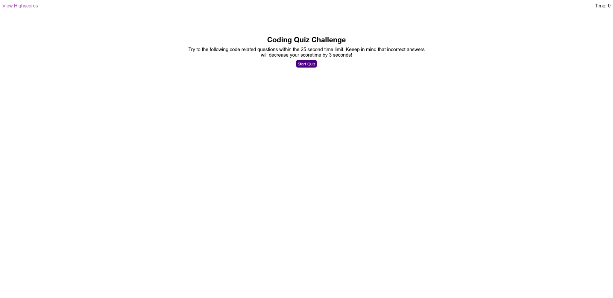

# code quiz

challenge 4

## Features

- 5 questions in a predetermined order

- easy to update timer object with all text elements referencing it (intro paragraph, top right counter, etc.) updating dynamically

- score diplayed at the end with the ability to save score with a user inputed name to local storage

- previous score can be check on the highscore page via the link at the top left

- previous score can be erased with a deticated button.

- 'go back' and 'restart' buttons reload the page back to the start

## [Deployed Site](https://carljmcgee.github.io/code-quiz/)

